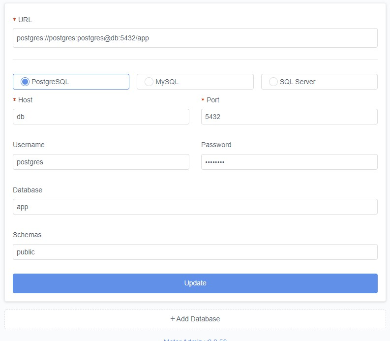

# SEP Low Code demo
A sample container application with Motor Admin and a seed database.

## Database structure

```
|-- `postgres`: database for the Hasura v2 application
|-- `motor_admin`: database for the MotorAdmin application
|-- `app`: database for the demo application
```

## System requirements

- `Git`
- `Docker desktop`

## <a name="#initialize">Initialization</a>

- **Start Docker Desktop**
- Open a terminal window (`cmd` or `git bash`) command line terminal in the root directory of the project directory and execute the following commands:

1. `docker-compose up`. This will start all the services defined in `docker-compose.yml`.
2. Open `http://localhost:3005`
3. Fill out the user details
4. Fill out the database connection details




---

### Start containers (make sure Docker Desktop/Docker deamon is running)

Open a `git bash` terminal in the root directory of the project and run `docker-compose up`

### Stop containers

Open a `git bash` terminal in the root directory of the project and run `docker-compose stop`.

### Remove the containers

Run `docker-compose down`. After that, you can run `docker volume prune` to wipe mounted volumes. 

---

## Vscode extensions for more productivity

- `Eslint` (https://marketplace.visualstudio.com/items?itemName=dbaeumer.vscode-eslint)
- `GraphQL` (https://marketplace.visualstudio.com/items?itemName=GraphQL.vscode-graphql)
- `Prettier - Code formatter` (https://marketplace.visualstudio.com/items?itemName=esbenp.prettier-vscode)
  - You can configure VSCode to format on file save
